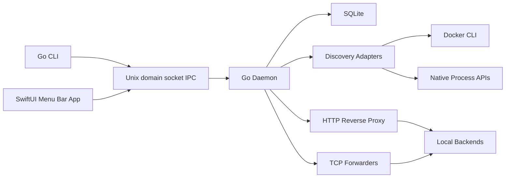

# Architecture Overview

Portnado is a monorepo with three logical runtime components:

- Go daemon: owns discovery, routing, persistence, logs, and local IPC.
- Go CLI: communicates with the daemon and performs diagnostics, setup, configuration validation, and route management.
- SwiftUI menu bar app: displays state, approvals, settings, diagnostics, and launch-at-login controls.

## Runtime Boundaries

The daemon is the only component that mutates route state. The CLI and UI request state changes through IPC. This keeps persistence, approval checks, and routing lifecycle decisions in one process.

## Discovery

Discovery is read-only. Adapters produce observations with evidence and confidence. Later reconciliation converts observations into suggestions or backend updates for previously approved routes.

## Routing

HTTP routing uses normalized Host headers and stable `.localhost` hostnames. TCP routing uses stable frontend ports because raw TCP cannot be routed by hostname alone.

## Persistence

SQLite stores projects, services, observations, suggestions, confirmed routes, TCP port assignments, scan runs, settings, migrations, and sanitized diagnostic events.

## Security Posture

All runtime listeners bind to `127.0.0.1`. IPC uses a current-user Unix domain socket. Privileged setup is optional, minimized, previewed, and reversible.
